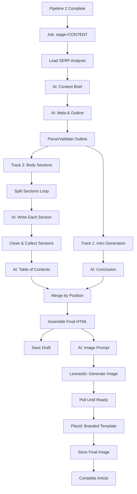

# 🚀 Pipeline 3: Complete Content Generation Implementation Plan

## 📋 Overview

Based on your detailed specification, Pipeline 3 is a comprehensive content generation system that transforms SERP analysis into complete, branded articles with featured images. This plan addresses ALL the components you outlined.

## 🏗️ Complete Architecture



## 🎯 Implementation Components

### **1. Job Stage Management**

#### **1.1 Update Job Model**
```python
# Current Job model already has 'stage' field - we'll use it
JOB_STAGE_CONTENT = "CONTENT"
JOB_STAGE_DRAFT = "DRAFT"
JOB_STAGE_IMAGE = "IMAGE"
JOB_STAGE_COMPLETE = "COMPLETE"
```

#### **1.2 Content Generation Job Picker**
```python
# app/services/content_generation.py
def pick_content_jobs(db: Session) -> List[Job]:
    """Pick up all jobs where stage = CONTENT"""
    return db.query(Job).filter(
        Job.job_type == "content_generation",
        Job.stage == JOB_STAGE_CONTENT,
        Job.status == "QUEUED"
    ).all()
```

### **2. SERP Analysis Integration**

#### **2.1 SERP Data Loader**
```python
async def load_serp_analysis(job_id: str, brand_id: str, db: Session) -> SerpAnalysisData:
    """Load + aggregate SERP analysis from Pipeline 2"""
    serp_analyses = db.query(SerpAnalysis).filter(
        SerpAnalysis.brand_id == brand_id,
        SerpAnalysis.job_id == job_id  # Link to Pipeline 2 job
    ).all()
    
    competitor_analyses = []
    for serp in serp_analyses:
        competitors = db.query(CompetitorAnalysis).filter(
            CompetitorAnalysis.serp_analysis_id == serp.id
        ).all()
        competitor_analyses.extend(competitors)
    
    return SerpAnalysisData(
        keywords=[(s.keyword_text, s.content_gap_score) for s in serp_analyses],
        competitor_gaps=extract_content_gaps(competitor_analyses),
        competitive_advantages=identify_advantages(competitor_analyses),
        serp_metadata=compile_serp_metadata(serp_analyses)
    )
```

### **3. AI Content Brief Generation**

#### **3.1 Enhanced Brief Generator**
```python
async def generate_content_brief(
    serp_data: SerpAnalysisData,
    brand_profile: BrandProfile,
    target_keyword: str
) -> ContentBrief:
    """AI · gpt-4 reads ClientProfile → Content Brief"""
    
    prompt = render_prompt("content/v1/brief.txt", {
        "brand_profile": {
            "one_liner": brand_profile.one_liner,
            "audience_personas": brand_profile.audience_personas,
            "tone_rules": brand_profile.tone_rules,
            "unique_angle": brand_profile.unique_angle,
            "ctas": brand_profile.ctas,
            "internal_links": brand_profile.internal_links
        },
        "target_keyword": target_keyword,
        "competitor_gaps": serp_data.competitor_gaps,
        "competitive_advantages": serp_data.competitive_advantages,
        "serp_insights": serp_data.serp_metadata
    })
    
    llm = LLMService()
    raw = await llm.call(
        model=get_settings().extraction_model,
        prompt=prompt,
        response_format="json",
        max_tokens=2000,
        temperature=0.4
    )
    
    data = safe_json_parse(raw)
    return ContentBrief(
        goal=data["goal"],
        content_type=data["type"],
        target_audience=data["audience"],
        search_intent=data["intent"],
        target_word_count=data["word_count"],
        content_angle=data["angle"],
        ctas=data["ctas"],
        sections=data["sections"]
    )
```

### **4. Meta & Outline Generation**

#### **4.1 Meta Generator**
```python
async def generate_meta_and_outline(
    content_brief: ContentBrief,
    brand_profile: BrandProfile,
    keyword: str
) -> MetaAndOutline:
    """AI · gpt-4.1-mini reads ClientProfile → Meta & Outline"""
    
    prompt = render_prompt("content/v1/meta_outline.txt", {
        "content_brief": content_brief,
        "brand_profile": brand_profile,
        "keyword": keyword
    })
    
    llm = LLMService()
    raw = await llm.call(
        model="claude-3-5-haiku-20241022",  # Faster model for structured output
        prompt=prompt,
        response_format="json",
        max_tokens=1500,
        temperature=0.3
    )
    
    data = safe_json_parse(raw)
    return MetaAndOutline(
        slug=data["slug"],
        meta_title=data["meta_title"],
        meta_description=data["meta_description"],
        h1=data["h1"],
        sections=data["sections"]  # Array with phases
    )
```

#### **4.2 Outline Parser & Validator**
```python
def parse_and_validate_outline(outline_data: dict) -> ValidatedOutline:
    """Parse + validate outline - Safe JSON parse; assert sections non-empty"""
    
    if not outline_data.get("sections") or len(outline_data["sections"]) == 0:
        raise ValueError("Outline must contain at least one section")
    
    validated_sections = []
    for i, section in enumerate(outline_data["sections"]):
        if not section.get("heading") or not section.get("phases"):
            raise ValueError(f"Section {i} missing heading or phases")
        
        validated_sections.append(ValidatedSection(
            index=i,
            heading=section["heading"],
            heading_type=section.get("heading_type", "h2"),
            phases=section["phases"],
            estimated_words=section.get("estimated_words", 300)
        ))
    
    return ValidatedOutline(sections=validated_sections)
```

### **5. Parallel Content Generation**

#### **5.1 Introduction Track**
```python
async def generate_introduction(
    content_brief: ContentBrief,
    brand_profile: BrandProfile,
    keyword: str
) -> str:
    """Track 1 · intro - AI · gpt-4 reads ClientProfile → Introduction (300–500w HTML)"""
    
    prompt = render_prompt("content/v1/introduction.txt", {
        "content_brief": content_brief,
        "brand_profile": {
            "tone_rules": brand_profile.tone_rules,
            "banned_phrases": brand_profile.banned_phrases,
            "site_url": brand_profile.site_url
        },
        "keyword": keyword,
        "target_length": "300-500 words"
    })
    
    llm = LLMService()
    return await llm.call(
        model=get_settings().extraction_model,
        prompt=prompt,
        response_format="text",
        max_tokens=800,
        temperature=0.6
    )
```

#### **5.2 Body Sections Track**
```python
async def generate_body_sections(
    outline: ValidatedOutline,
    content_brief: ContentBrief,
    brand_profile: BrandProfile
) -> List[GeneratedSection]:
    """Track 2 · body - Split sections → Loop per section"""
    
    async def generate_single_section(section: ValidatedSection) -> GeneratedSection:
        prompt = render_prompt("content/v1/section.txt", {
            "section": section,
            "content_brief": content_brief,
            "brand_profile": {
                "tone_rules": brand_profile.tone_rules,
                "banned_phrases": brand_profile.banned_phrases,
                "unique_angle": brand_profile.unique_angle
            },
            "global_context": {
                "section_index": section.index,
                "total_sections": len(outline.sections)
            }
        })
        
        llm = LLMService()
        html_content = await llm.call(
            model=get_settings().extraction_model,
            prompt=prompt,
            response_format="text",
            max_tokens=1200,
            temperature=0.6
        )
        
        # Clean fences + collect
        cleaned_content = clean_markdown_fences(html_content)
        word_count = count_words_in_html(cleaned_content)
        
        return GeneratedSection(
            index=section.index,
            heading=section.heading,
            heading_type=section.heading_type,
            content=cleaned_content,
            word_count=word_count
        )
    
    # Generate all sections in parallel (batches of 3)
    batch_size = 3
    all_sections = []
    
    for i in range(0, len(outline.sections), batch_size):
        batch = outline.sections[i:i + batch_size]
        batch_results = await asyncio.gather(*[
            generate_single_section(section) for section in batch
        ])
        all_sections.extend(batch_results)
    
    # Sort by index to maintain order
    return sorted(all_sections, key=lambda s: s.index)
```

### **6. Table of Contents & Conclusion**

#### **6.1 TOC Generator**
```python
async def generate_table_of_contents(sections: List[GeneratedSection]) -> str:
    """AI · gpt-4 → Table of Contents (Structural — no client fragments)"""
    
    section_data = [
        {"heading": s.heading, "level": s.heading_type}
        for s in sections
    ]
    
    prompt = render_prompt("content/v1/toc.txt", {
        "sections": section_data
    })
    
    llm = LLMService()
    return await llm.call(
        model=get_settings().extraction_model,
        prompt=prompt,
        response_format="text",
        max_tokens=500,
        temperature=0.3
    )
```

#### **6.2 Conclusion Generator**
```python
async def generate_conclusion(
    content_brief: ContentBrief,
    brand_profile: BrandProfile,
    sections: List[GeneratedSection]
) -> str:
    """AI · gpt-4 reads ClientProfile → Conclusion (Takeaways + CTA)"""
    
    key_takeaways = [s.heading for s in sections]
    
    prompt = render_prompt("content/v1/conclusion.txt", {
        "content_brief": content_brief,
        "key_takeaways": key_takeaways,
        "brand_profile": {
            "ctas": brand_profile.ctas,
            "unique_angle": brand_profile.unique_angle,
            "site_url": brand_profile.site_url
        }
    })
    
    llm = LLMService()
    return await llm.call(
        model=get_settings().extraction_model,
        prompt=prompt,
        response_format="text",
        max_tokens=600,
        temperature=0.6
    )
```

### **7. Content Assembly**

#### **7.1 Content Merger**
```python
def merge_content_by_position(
    introduction: str,
    table_of_contents: str,
    body_sections: List[GeneratedSection],
    conclusion: str
) -> AssembledContent:
    """Merge (intro · TOC · conclusion) by position"""
    
    # Sort sections by index
    sorted_sections = sorted(body_sections, key=lambda s: s.index)
    
    # Build section HTML
    sections_html = []
    for section in sorted_sections:
        section_html = f"""
        <{section.heading_type}>{section.heading}</{section.heading_type}>
        {section.content}
        """
        sections_html.append(section_html.strip())
    
    body_html = "\n\n".join(sections_html)
    
    return AssembledContent(
        introduction=introduction,
        table_of_contents=table_of_contents,
        body=body_html,
        conclusion=conclusion,
        total_word_count=sum(s.word_count for s in body_sections)
    )
```

#### **7.2 Final Article Assembly**
```python
def assemble_article_html(assembled_content: AssembledContent, meta: MetaAndOutline) -> FinalArticle:
    """Assemble article HTML + word count - Sort sections by index → concatenate inside <article>"""
    
    full_html = f"""
    <article class="generated-content">
        <header>
            <h1>{meta.h1}</h1>
        </header>
        
        <div class="introduction">
            {assembled_content.introduction}
        </div>
        
        <div class="table-of-contents">
            {assembled_content.table_of_contents}
        </div>
        
        <div class="article-body">
            {assembled_content.body}
        </div>
        
        <div class="conclusion">
            {assembled_content.conclusion}
        </div>
    </article>
    """.strip()
    
    return FinalArticle(
        meta_title=meta.meta_title,
        meta_description=meta.meta_description,
        slug=meta.slug,
        html_content=full_html,
        word_count=assembled_content.total_word_count
    )
```

### **8. Draft Persistence**

#### **8.1 Content Storage**
```python
async def save_content_draft(
    job: Job,
    article: FinalArticle,
    db: Session
) -> ContentDraft:
    """Save to content · Stage = Draft"""
    
    draft = ContentDraft(
        id=uuid_str(),
        job_id=job.id,
        brand_id=job.brand_id,
        org_id=job.org_id,
        title=article.meta_title,
        slug=article.slug,
        meta_description=article.meta_description,
        html_content=article.html_content,
        word_count=article.word_count,
        stage="DRAFT",
        status="PENDING_IMAGE"
    )
    
    db.add(draft)
    
    # Update job stage
    job.stage = JOB_STAGE_DRAFT
    job.status = "PROCESSING"  # Continue to image generation
    
    db.commit()
    return draft
```

### **9. Image Generation Pipeline**

#### **9.1 Image Prompt Generation**
```python
async def generate_image_prompt(
    article: FinalArticle,
    brand_profile: BrandProfile
) -> str:
    """AI · gpt-4o reads ClientProfile → Image Prompt"""
    
    prompt = render_prompt("content/v1/image_prompt.txt", {
        "article_title": article.meta_title,
        "article_content": article.html_content[:1000],  # First 1000 chars
        "brand_profile": {
            "image_subject_hints": brand_profile.image_subject_hints,
            "image_palette": brand_profile.image_palette,
            "visual_direction": brand_profile.visual_direction,
            "industry": brand_profile.industry
        },
        "constraints": "No real people, professional style"
    })
    
    llm = LLMService()
    return await llm.call(
        model="claude-3-5-sonnet-20241022",  # Best model for creative prompts
        prompt=prompt,
        response_format="text",
        max_tokens=300,
        temperature=0.7
    )
```

#### **9.2 Leonardo AI Integration**
```python
# app/services/leonardo.py
class LeonardoService:
    def __init__(self):
        self.api_key = get_settings().leonardo_api_key
        self.base_url = "https://cloud.leonardo.ai/api/rest/v1"
    
    async def request_generation(self, prompt: str, style_preset: str = "LEONARDO") -> str:
        """API · Leonardo → Request generation"""
        payload = {
            "prompt": prompt,
            "num_images": 1,
            "modelId": "6bef9f1b-29cb-40c7-b9df-32b51c1f67d3",  # Leonardo Creative
            "width": 1024,
            "height": 576,  # 16:9 aspect ratio
            "presetStyle": style_preset
        }
        
        async with httpx.AsyncClient() as client:
            response = await client.post(
                f"{self.base_url}/generations",
                headers={"Authorization": f"Bearer {self.api_key}"},
                json=payload
            )
            response.raise_for_status()
            data = response.json()
            return data["sdGenerationJob"]["generationId"]
    
    async def poll_until_ready(self, generation_id: str, max_attempts: int = 30) -> str:
        """Poll until ready → extract URL"""
        for attempt in range(max_attempts):
            async with httpx.AsyncClient() as client:
                response = await client.get(
                    f"{self.base_url}/generations/{generation_id}",
                    headers={"Authorization": f"Bearer {self.api_key}"}
                )
                response.raise_for_status()
                data = response.json()
                
                if data["generations_by_pk"]["status"] == "COMPLETE":
                    images = data["generations_by_pk"]["generated_images"]
                    if images:
                        return images[0]["url"]
                
                await asyncio.sleep(10)  # Wait 10 seconds between polls
        
        raise TimeoutError(f"Image generation timed out after {max_attempts * 10} seconds")
```

#### **9.3 Placid Integration**
```python
# app/services/placid.py
class PlacidService:
    def __init__(self):
        self.api_key = get_settings().placid_api_key
        self.base_url = "https://api.placid.app/v1"
    
    async def composite_branded_template(
        self,
        template_id: str,
        generated_image_url: str,
        title: str,
        brand_profile: BrandProfile
    ) -> str:
        """API · Placid → Composite into branded template"""
        
        template_data = {
            "background_image": generated_image_url,
            "title_text": title,
            "brand_name": brand_profile.name,
            "brand_colors": brand_profile.image_palette or "#000000,#FFFFFF"
        }
        
        async with httpx.AsyncClient() as client:
            response = await client.post(
                f"{self.base_url}/templates/{template_id}/render",
                headers={"Authorization": f"Bearer {self.api_key}"},
                json=template_data
            )
            response.raise_for_status()
            data = response.json()
            return data["image_url"]
```

#### **9.4 Complete Image Workflow**
```python
async def generate_featured_image(
    article: FinalArticle,
    brand_profile: BrandProfile,
    job: Job,
    db: Session
) -> Optional[str]:
    """Complete image generation workflow with defensive fallbacks"""
    
    try:
        # Generate image prompt
        image_prompt = await generate_image_prompt(article, brand_profile)
        
        # Generate with Leonardo
        leonardo = LeonardoService()
        generation_id = await leonardo.request_generation(image_prompt)
        raw_image_url = await leonardo.poll_until_ready(generation_id)
        
        # Composite with Placid if template configured
        final_image_url = raw_image_url
        if brand_profile.placid_template_id:
            placid = PlacidService()
            final_image_url = await placid.composite_branded_template(
                brand_profile.placid_template_id,
                raw_image_url,
                article.meta_title,
                brand_profile
            )
        
        # Store in brand's bucket
        stored_url = await store_image_in_bucket(
            final_image_url,
            brand_profile.image_output_bucket or "default-images",
            f"{job.id}-featured.jpg"
        )
        
        return stored_url
        
    except Exception as e:
        logger.error(f"Image generation failed for job {job.id}: {e}")
        # Defensive fallback - log & keep article usable
        return None
```

### **10. Database Models**

#### **10.1 Content Draft Model**
```python
# Add to app/models/blog.py
class ContentDraft(Base, TimestampMixin):
    __tablename__ = "content_drafts"
    
    id: Mapped[str] = mapped_column(Uuid(as_uuid=False), primary_key=True, default=uuid_str)
    job_id: Mapped[str] = mapped_column(Uuid(as_uuid=False), ForeignKey("jobs.id"), nullable=False)
    brand_id: Mapped[str] = mapped_column(Uuid(as_uuid=False), ForeignKey("brands.id"), nullable=False)
    org_id: Mapped[str] = mapped_column(Uuid(as_uuid=False), ForeignKey("organizations.id"), nullable=False)
    
    title: Mapped[str] = mapped_column(String, nullable=False)
    slug: Mapped[str] = mapped_column(String, nullable=False)
    meta_description: Mapped[str] = mapped_column(Text)
    html_content: Mapped[str] = mapped_column(Text, nullable=False)
    word_count: Mapped[int] = mapped_column(Integer, nullable=False)
    
    featured_image_url: Mapped[str | None] = mapped_column(String)
    image_generation_status: Mapped[str] = mapped_column(String, default="pending")
    
    stage: Mapped[str] = mapped_column(String, nullable=False)  # DRAFT, IMAGE, COMPLETE
    status: Mapped[str] = mapped_column(String, nullable=False)  # PENDING_IMAGE, READY, PUBLISHED
    
    content_brief: Mapped[dict] = mapped_column(JSON)
    seo_score: Mapped[int | None] = mapped_column(Integer)
    competitive_score: Mapped[int | None] = mapped_column(Integer)
```

### **11. Main Orchestrator**

#### **11.1 Complete Pipeline Orchestrator**
```python
async def run_content_generation_pipeline(db: Session, job_id: str) -> None:
    """Main orchestrator - handles complete Pipeline 3 flow"""
    
    job = db.query(Job).filter(Job.id == job_id).one_or_none()
    if not job:
        logger.error(f"Job {job_id} not found")
        return
    
    try:
        # 01. Load SERP analysis
        serp_data = await load_serp_analysis(job_id, job.brand_id, db)
        
        # 02. Get brand profile
        brand_profile = db.query(BrandProfile).filter(
            BrandProfile.brand_id == job.brand_id
        ).first()
        
        target_keyword = job.input_payload.get("keyword")
        
        # 03. Generate content brief
        content_brief = await generate_content_brief(serp_data, brand_profile, target_keyword)
        
        # 04. Generate meta & outline
        meta_outline = await generate_meta_and_outline(content_brief, brand_profile, target_keyword)
        
        # 05. Parse & validate outline
        validated_outline = parse_and_validate_outline(meta_outline.dict())
        
        # 06. Parallel content generation
        intro_task = generate_introduction(content_brief, brand_profile, target_keyword)
        body_task = generate_body_sections(validated_outline, content_brief, brand_profile)
        
        introduction, body_sections = await asyncio.gather(intro_task, body_task)
        
        # 07. Generate TOC and conclusion
        toc_task = generate_table_of_contents(body_sections)
        conclusion_task = generate_conclusion(content_brief, brand_profile, body_sections)
        
        toc, conclusion = await asyncio.gather(toc_task, conclusion_task)
        
        # 08. Merge content
        assembled_content = merge_content_by_position(introduction, toc, body_sections, conclusion)
        
        # 09. Assemble final article
        final_article = assemble_article_html(assembled_content, meta_outline)
        
        # 10. Save draft
        draft = await save_content_draft(job, final_article, db)
        
        # 11. Generate featured image (non-blocking)
        image_url = await generate_featured_image(final_article, brand_profile, job, db)
        
        if image_url:
            draft.featured_image_url = image_url
            draft.image_generation_status = "completed"
            draft.status = "READY"
        else:
            draft.image_generation_status = "failed"
            draft.status = "READY"  # Article still usable
        
        job.stage = JOB_STAGE_COMPLETE
        job.status = "SUCCEEDED"
        db.commit()
        
        logger.info(f"Content generation completed for job {job_id}")
        
    except Exception as e:
        logger.exception(f"Content generation failed for job {job_id}")
        job.status = "FAILED"
        job.error_message = str(e)
        db.commit()
```

### **12. Queue Integration**

#### **12.1 Worker Task**
```python
# worker/tasks/content_generation.py
def run_content_generation_pipeline_task(job_id: str) -> None:
    """RQ worker task for content generation"""
    from app.db import get_db
    from app.services.content_generation import run_content_generation_pipeline
    
    db = next(get_db())
    try:
        asyncio.run(run_content_generation_pipeline(db, job_id))
    finally:
        db.close()
```

#### **12.2 Job Dispatcher Integration**
```python
# Add to app/services/job_dispatcher.py
def enqueue_content_generation(self, *, job_id: str, max_retries: int = 1) -> None:
    """Enqueue Pipeline 3: Content Generation task."""
    retry = _maybe_retry(max_retries)
    queue.get_queue("content_generation").enqueue(
        "worker.tasks.content_generation.run_content_generation_pipeline_task",
        kwargs={"job_id": job_id},
        job_id=f"content_gen_{job_id}",
        retry=retry,
    )
```

### **13. API Endpoints**

```python
# Add to app/routers/content.py
@router.post("/{brand_id}/content/generate")
def trigger_content_generation(
    brand_id: str,
    payload: ContentGenerationRequest,
    db: Session = Depends(get_db),
    current_user: CurrentUser = Depends(get_current_user),
):
    """Trigger Pipeline 3 content generation from SERP analysis"""
    
    # Create content generation job
    job = Job(
        brand_id=brand_id,
        org_id=current_user.org_id,
        job_type="content_generation",
        stage=JOB_STAGE_CONTENT,
        status="QUEUED",
        input_payload={
            "keyword": payload.keyword,
            "serp_analysis_job_id": payload.serp_analysis_job_id
        }
    )
    db.add(job)
    db.flush()
    
    # Enqueue for processing
    dispatcher = JobDispatcher()
    dispatcher.enqueue_content_generation(job_id=job.id)
    
    db.commit()
    return {"job_id": job.id, "status": "queued"}
```

## 🔧 Configuration Requirements

### **New Environment Variables:**
```bash
# Image Generation
LEONARDO_API_KEY=your_leonardo_key
PLACID_API_KEY=your_placid_key

# Storage
DEFAULT_IMAGE_BUCKET=100xai-content-images
```

## 📊 Success Metrics

- **Content Quality**: SEO score + competitive advantage score
- **Generation Speed**: Target < 10 minutes per article
- **Image Success Rate**: Target > 90% image generation success
- **Word Count Accuracy**: Target ±10% of specified word count

This implementation covers ALL the components you specified with proper error handling, parallel processing, and defensive fallbacks. Ready to start with Phase 1?