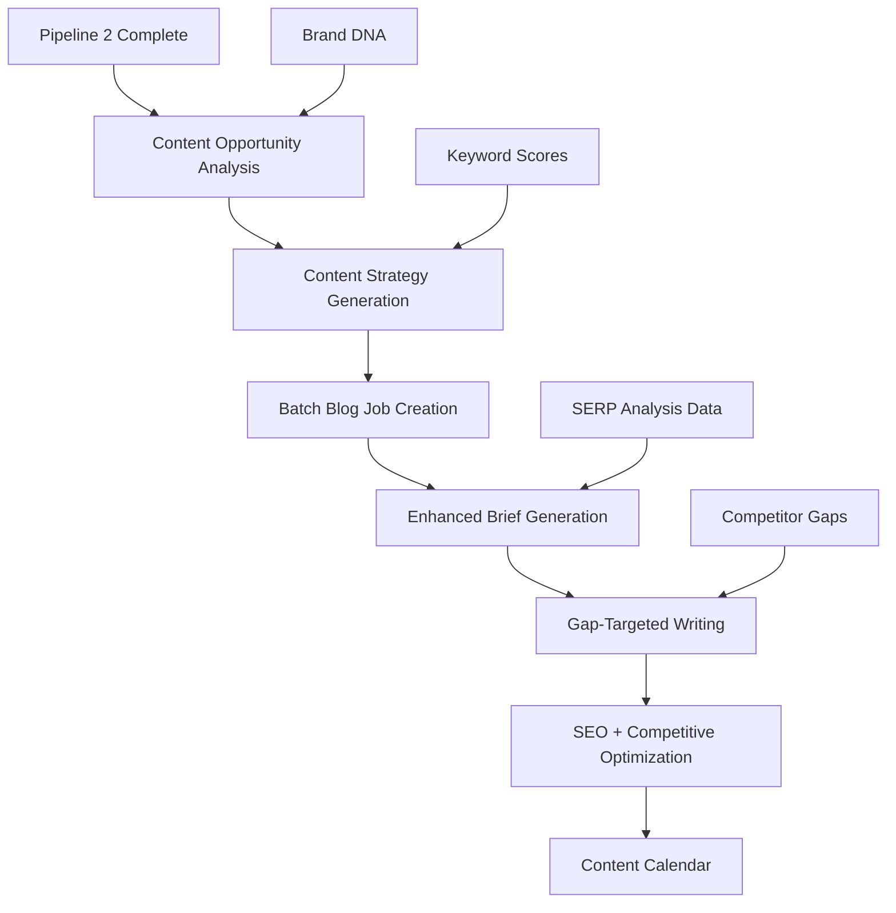

# 🚀 Pipeline 3: Intelligent Content Generation Plan

## 📋 Executive Summary

Pipeline 3 transforms competitive intelligence from Pipelines 1 & 2 into high-quality, SEO-optimized content. It leverages:
- **Keywords** from Pipeline 1 (Keyword Research) 
- **Competitive gaps** from Pipeline 2 (SERP Analysis)
- **Brand DNA** from onboarding
- **Existing blog system** for content generation

## 🎯 Current State Analysis

### ✅ **What Already Exists:**
1. **Complete Blog Pipeline** (`app/services/blog_pipeline.py`)
   - SERP research → Brief generation → Section writing
   - Multi-stage workflow with approval gates
   - SEO scoring and optimization
   - Queue-based processing

2. **Database Models** (`app/models/blog.py`)
   - BlogJob, BlogBrief, BlogSection, BlogDraft
   - Full workflow states and relationships

3. **API Endpoints** (`app/routers/blogs.py`)
   - Create, approve, reject blog jobs
   - Manual keyword-based blog generation

4. **LLM Integration** 
   - Anthropic API for content generation
   - JSON and text generation modes
   - Prompt templates in `prompts/blog/`

### ❌ **What's Missing:**
1. **Pipeline Integration**: No automatic trigger from Pipeline 2 → Pipeline 3
2. **Competitive Intelligence Usage**: SERP analysis data not used in content generation
3. **Batch Content Generation**: No bulk content creation from keyword research
4. **Content Gap Targeting**: Not leveraging competitor weaknesses
5. **Auto-Scheduling**: No intelligent content calendar generation

## 🏗️ Pipeline 3 Architecture



### 🔧 **Core Components:**

#### 1. **Content Opportunity Analyzer**
- **Input**: Pipeline 2 SERP analysis results
- **Process**: Identify content gaps and opportunities
- **Output**: Ranked content opportunities with competitive advantage scores

#### 2. **Content Strategy Generator** 
- **Input**: Keywords + competitive gaps + brand DNA
- **Process**: Generate content strategy and publishing calendar
- **Output**: Strategic content plan with priorities

#### 3. **Enhanced Blog Pipeline**
- **Extends existing blog system**
- **Adds competitive intelligence to brief generation**
- **Includes gap-targeted content creation**

#### 4. **Batch Content Orchestrator**
- **Creates multiple blog jobs from Pipeline 2 output**
- **Manages content production workflow**
- **Handles scheduling and dependencies**

## 📊 Data Flow Integration

### **Pipeline 1 → Pipeline 2 → Pipeline 3:**

```
[Keyword Research] 
    ↓ (keywords with scores)
[SERP Analysis]
    ↓ (competitor gaps + content opportunities)  
[Content Generation]
    ↓ (optimized content targeting gaps)
[Published Content]
```

### **Key Data Connections:**
1. **Keywords Table** → Content topics
2. **SerpAnalysis Table** → Competitive positioning
3. **CompetitorAnalysis Table** → Gap identification
4. **BrandProfile Table** → Brand voice and positioning

## 🛠️ Implementation Plan

### **Phase 1: Content Opportunity Analysis (Week 1)**

#### 1.1 Content Opportunity Service
```python
# app/services/content_opportunity.py
class ContentOpportunityAnalyzer:
    async def analyze_serp_results(brand_id: str, serp_analyses: List[SerpAnalysis]) -> List[ContentOpportunity]
    async def rank_opportunities(opportunities: List[ContentOpportunity]) -> List[RankedOpportunity]
    async def generate_content_angles(opportunity: ContentOpportunity, brand_profile: BrandProfile) -> List[ContentAngle]
```

#### 1.2 Database Extensions
```sql
-- New table for content opportunities
CREATE TABLE content_opportunities (
    id UUID PRIMARY KEY,
    brand_id UUID REFERENCES brands(id),
    serp_analysis_id UUID REFERENCES serp_analyses(id),
    keyword_text VARCHAR NOT NULL,
    opportunity_type VARCHAR NOT NULL, -- 'gap', 'weakness', 'angle', 'format'
    competitive_advantage_score INTEGER,
    content_angles JSONB,
    priority_score INTEGER,
    status VARCHAR DEFAULT 'identified',
    created_at TIMESTAMP DEFAULT NOW()
);
```

#### 1.3 Auto-Trigger Integration
```python
# Add to app/services/seo_research.py in run_serp_analysis()
async def run_serp_analysis(...):
    # Existing SERP analysis code
    result = await analyze_competitors(...)
    
    # NEW: Trigger Pipeline 3
    if result['status'] == 'success':
        await trigger_content_generation(
            brand_id=brand_id,
            serp_analyses=result['analyses']
        )
```

### **Phase 2: Enhanced Content Generation (Week 2)**

#### 2.1 Competitive Brief Generator
```python
# Enhance existing blog_pipeline.py
async def generate_competitive_brief(
    keyword: str,
    brand_profile: BrandProfile, 
    serp_analysis: SerpAnalysis,
    content_opportunity: ContentOpportunity
) -> BlogBrief:
    # Enhanced prompt with competitor gap analysis
    # Includes specific competitive angles
    # Targets identified weaknesses
```

#### 2.2 Gap-Targeted Content Writing
```python
# Enhanced section generation with competitive positioning
async def generate_section_with_gaps(
    section: BlogSection,
    competitor_gaps: List[str],
    competitive_advantages: List[str]
) -> str:
    # Content specifically designed to fill competitor gaps
    # Emphasizes brand's unique advantages
    # Targets competitor weaknesses
```

#### 2.3 New Prompt Templates
```
prompts/blog/v2/
├── competitive_brief.txt     # Brief with competitor analysis
├── gap_targeted_section.txt  # Section targeting competitor gaps
├── opportunity_angle.txt     # Content angle generation
└── content_strategy.txt      # Overall content strategy
```

### **Phase 3: Batch Content Orchestration (Week 3)**

#### 3.1 Content Campaign Manager
```python
# app/services/content_campaign.py
class ContentCampaignManager:
    async def create_content_campaign(brand_id: str, serp_analyses: List[SerpAnalysis]) -> ContentCampaign
    async def generate_publishing_calendar(campaign: ContentCampaign) -> PublishingCalendar
    async def batch_create_blog_jobs(calendar: PublishingCalendar) -> List[BlogJob]
```

#### 3.2 Content Calendar Database
```sql
CREATE TABLE content_campaigns (
    id UUID PRIMARY KEY,
    brand_id UUID REFERENCES brands(id),
    name VARCHAR NOT NULL,
    strategy JSONB,
    total_content_pieces INTEGER,
    status VARCHAR DEFAULT 'planning',
    start_date DATE,
    end_date DATE
);

CREATE TABLE content_calendar (
    id UUID PRIMARY KEY,
    campaign_id UUID REFERENCES content_campaigns(id),
    blog_job_id UUID REFERENCES blog_jobs(id),
    keyword_text VARCHAR,
    opportunity_type VARCHAR,
    scheduled_date DATE,
    priority_score INTEGER
);
```

#### 3.3 Auto-Generation Workflow
```python
# Complete Pipeline 2 → Pipeline 3 flow
async def trigger_content_generation(brand_id: str, serp_analyses: List[SerpAnalysis]):
    # 1. Analyze opportunities
    opportunities = await analyze_content_opportunities(brand_id, serp_analyses)
    
    # 2. Create content strategy
    strategy = await generate_content_strategy(brand_id, opportunities)
    
    # 3. Create content campaign
    campaign = await create_content_campaign(brand_id, strategy)
    
    # 4. Generate publishing calendar
    calendar = await generate_publishing_calendar(campaign)
    
    # 5. Batch create blog jobs
    blog_jobs = await batch_create_blog_jobs(calendar)
    
    # 6. Enqueue first batch for processing
    await enqueue_blog_jobs(blog_jobs[:5])  # Start with top 5
```

### **Phase 4: Advanced Features (Week 4)**

#### 4.1 Content Performance Optimization
- **A/B testing** for content angles
- **Performance tracking** integration
- **Iterative improvement** based on results

#### 4.2 Multi-Format Content Generation
- **Blog posts** (existing)
- **Social media** content
- **Email campaigns** 
- **Landing pages**

#### 4.3 Content Distribution Integration
- **WordPress publishing** (existing integration)
- **Social scheduling**
- **Email automation**
- **SEO monitoring**

## 🔗 API Integration Points

### **New Endpoints:**

```python
# Content opportunity management
POST   /v1/brands/{brand_id}/content-opportunities/analyze
GET    /v1/brands/{brand_id}/content-opportunities
GET    /v1/brands/{brand_id}/content-opportunities/{opportunity_id}

# Content campaigns
POST   /v1/brands/{brand_id}/content-campaigns
GET    /v1/brands/{brand_id}/content-campaigns
POST   /v1/brands/{brand_id}/content-campaigns/{campaign_id}/generate

# Enhanced blog endpoints
POST   /v1/brands/{brand_id}/blogs/batch-create
GET    /v1/brands/{brand_id}/blogs/calendar
POST   /v1/brands/{brand_id}/blogs/{blog_id}/competitive-analysis
```

### **Enhanced Existing Endpoints:**
- Blog creation now accepts competitive context
- Brief generation includes competitor gap analysis
- Content scoring includes competitive advantage metrics

## 🎯 Success Metrics

### **Content Quality:**
- SEO scores improvement (target: +25% vs manual)
- Competitive advantage score (new metric)
- Content gap coverage percentage

### **Efficiency:**
- Time to publish (target: 80% reduction)
- Content production volume (target: 5x increase)
- Manual intervention reduction (target: 70%)

### **Business Impact:**
- Search ranking improvements
- Organic traffic growth
- Content engagement metrics

## 🚦 Implementation Priority

### **High Priority (MVP):**
1. ✅ Auto-trigger from Pipeline 2
2. ✅ Content opportunity analysis
3. ✅ Enhanced brief generation with competitive data
4. ✅ Batch blog job creation

### **Medium Priority:**
1. Content calendar generation
2. Gap-targeted writing optimization
3. Performance tracking integration

### **Low Priority (Future):**
1. Multi-format content generation
2. Advanced A/B testing
3. Predictive content strategy

## 💡 Unique Value Proposition

Pipeline 3 transforms your content strategy from reactive to **proactive and competitive**:

1. **Data-Driven**: Content decisions based on real competitive intelligence
2. **Gap-Focused**: Target competitor weaknesses systematically
3. **Brand-Aligned**: Maintain brand voice while maximizing competitive advantage
4. **Scalable**: Generate 10x more targeted content with same effort
5. **Integrated**: Seamless flow from keyword research → competitive analysis → content creation

## 🔧 Technical Integration Notes

### **Existing System Compatibility:**
- ✅ Builds on existing blog pipeline
- ✅ Reuses current database models
- ✅ Leverages existing LLM infrastructure
- ✅ Maintains current approval workflows

### **New Dependencies:**
- Content opportunity analysis algorithms
- Enhanced prompt templates
- Batch processing capabilities
- Calendar scheduling logic

This plan creates a comprehensive, competitive content generation system that maximizes the value of your keyword research and competitive analysis investments.