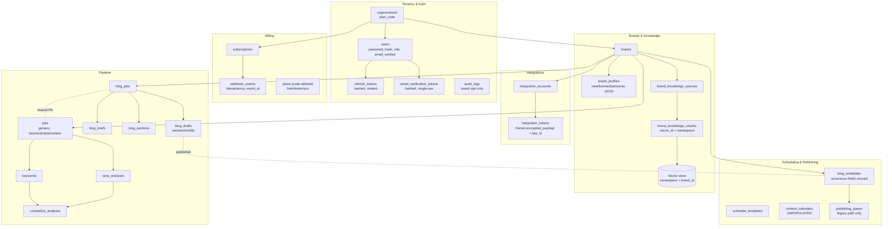
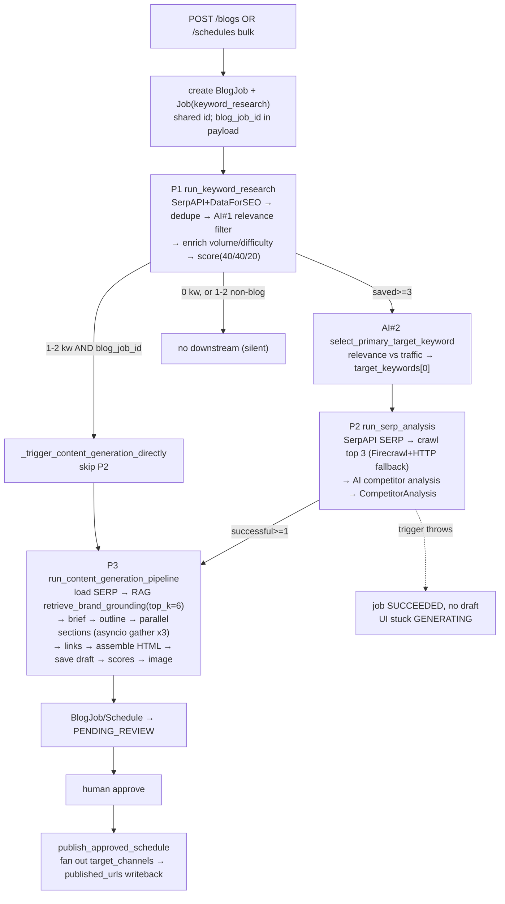

# Architecture Research Review — Content Platform

**Subject:** Multi-tenant SaaS for AI-powered SEO blog content generation
**Backend:** FastAPI + SQLAlchemy 2.0 + Alembic + RQ/Redis + vector store (Pinecone) + OpenAI embeddings + Razorpay billing
**Branch reviewed:** `feat/email-verification-razorpay-terms` (billing, email-verification, terms, and channel-OAuth code are uncommitted on this branch)
**Method:** Read-only investigation of migrations → models → worker/queue → webhook/billing → publishing → API routes, with version-history review for ordering. Every factual claim cites `file:line` (paths are relative to `backend/`). Claims are labelled **[evidenced]** (read in code), **[inferred]** (reasoned from evidence), or **[speculative]** (plausible, unverified).

---

## 1. Executive Summary

The platform is a SaaS that lets an organization onboard a "brand" (crawl its site, extract a tone/profile DNA, embed its knowledge into a vector store), then run an automated pipeline that researches keywords, analyzes competitor search results, and generates a full SEO-optimized blog draft — which a human reviews and approves before it is published to WordPress and other channels. Billing is via subscriptions with code-defined plan tiers.

**The good.** The domain model is coherent and the migrations are disciplined: foreign keys, cascades, unique constraints, and hot-path indexes are largely present and intentional. Auth is sound (bcrypt, HS256 access tokens, hashed+rotated refresh tokens, hashed single-use email-verification tokens). The pipeline is genuinely automated end-to-end with thoughtful additive layers (RAG grounding, an AI keyword-selection step) and a deliberate human review gate before publishing. Token encryption already supports key versioning. This is well above prototype quality in many places.

**Overall verdict: NOT production-ready as committed.** The single most serious issue is that the background-worker layer — which the *entire* product depends on — is not wired to consume the pipeline queues in any launcher present in the repo, and exists as two incomplete, divergent copies. Several data-integrity and concurrency gaps compound this. None of the issues are architectural dead-ends; they are finishable, but they are launch blockers.

### Top 5 risks

1. **Worker queue-registration gap + duplicated worker trees (Blocker).** The only launcher, `worker/main.py:15`, registers `Worker([Queue("onboarding"), Queue("purge"), Queue("default")])` and the container runs it directly (`infra/docker/Dockerfile.worker:28`). Nothing registers `keyword_research`, `serp_analysis`, `content_generation`, `blog`, or `publisher`. There are also two worker code trees (`/worker` and `/backend/worker`) and neither is complete — `/worker` has `purge.py` but not `content_generation.py`/`scheduler.py`; `/backend/worker` is the reverse. As committed, enqueued pipeline jobs are never consumed. **[evidenced]**

2. **Orphaned vectors & broken deletion hygiene (High).** Deleting a brand hard-deletes Postgres rows via CASCADE but never deletes the brand's vector-store namespace; `enqueue_purge` is never called and the `purge_brand` task only exists in the `/worker` tree the dispatcher may not be running against. No org-delete path exists. **[evidenced]** (`brand_service.py:67-91`, `job_dispatcher.py:48-53`)

3. **No double-publish protection (High).** The live publish task does a non-atomic check-then-act on schedule status with no row lock or `PENDING→PROCESSING` claim, so a retry or concurrent worker can publish twice. **[evidenced/inferred]** (`worker/tasks/scheduler.py:100-138`)

4. **Silent pipeline stalls (High).** If the SERP→content auto-trigger throws, the error is logged onto the job's payload but the job stays `SUCCEEDED` with no downstream draft; the blog UI shows `GENERATING` forever. The `<3 keywords` path also dead-ends for non-blog jobs. **[evidenced]** (`seo_research.py:1784-1793`, `blogs.py:174`)

5. **Webhook & billing reconciliation gaps + dev-secret defaults (High/Medium).** `webhook_events` stores no payload and no status; an out-of-order webhook for an unknown subscription is logged and dropped with a 200, with nothing retained to reconcile. Plan-limit enforcement covers only two entry points. Secrets default to placeholder values. **[evidenced]** (`services/billing.py:156-160`, `config.py:20,23`)

---

## 2. System Map (as implemented)

### 2.1 Subsystems



### 2.2 Content pipeline flow (actual runtime)



> Note: `publishing_queue` and the `run_publishing_scheduler` cron are the **legacy** time-triggered path, superseded by the approval-gated `publish_approved_schedule`. They remain in the code but the live routers only enqueue the approval path (`schedules.py:237`). **[evidenced]**

---

## 3. Subsystem Deep-Dives

### 3.1 Tenancy & Auth

**What it does.** Single-org-per-user tenancy with email/password auth, email verification, JWT sessions, and brand-scoped audit logging.

**How it works.**
- Signup creates the `Organization` immediately (`auth.py:105-107`), then a `User` with `role="admin"`, `email_verified=False`, and recorded terms acceptance (`auth.py:109-119`). No session is issued at signup; the response is `requires_verification=True` (`auth.py:129-133`). **[evidenced]**
- Tokens are first minted at **verification** (auto-login) and at `/login` via `_build_auth_response` (`auth.py:60-82,172`). **[evidenced]**
- Credentials live in `users.password_hash`, bcrypt with per-password salt (`auth/password.py:10-18`); no external IdP. **[evidenced]**
- JWT HS256, fixed issuer string; access token 15 min on `jwt_secret`, refresh token 30 days on a **separate** `refresh_token_secret` with a `jti` (`auth/jwt.py:7-64`, `config.py:22-24`). **[evidenced]**
- Refresh tokens are stored as sha256 hashes and rotated on use (old row `revoked=True`, new minted) (`auth.py:225-260`, `core.py:40-49`). Logout revokes by hash (`auth.py:263-269`). **[evidenced]**
- Email-verification tokens: `secrets.token_urlsafe(32)`, sha256-hashed, single-use, 24h expiry; resend invalidates prior tokens with an anti-enumeration generic response (`auth.py:47-57,175-198`, `config.py:65`). **[evidenced]**

**Why (rationale).** Issuing sessions only after verification and recording terms at signup is a compliance-forward design [inferred from the branch name `feat/email-verification-razorpay-terms` and `schemas/auth.py:26-31`]. Storing only token hashes and using a distinct refresh secret are deliberate security choices [evidenced by the hashing at `auth.py:50-54,66-72`].

**Trade-offs accepted.** No refresh-token reuse-detection/chain-revocation — a replayed rotated token simply 401s (`auth.py:225-260`) [evidenced]. Access tokens are stateless (no server-side revocation) — acceptable given the 15-min TTL [inferred].

**Risks.** Default secrets are placeholder strings (`config.py:20,23`) — a hard prod blocker if unoverridden [evidenced]. The app-level signup duplicate-email check is **global** (`auth.py:91-95`) while the DB constraint is **per-org** `uq_users_org_email` (`core.py:22`) — consistent today but a latent mismatch if multi-org is added [evidenced].

### 3.2 Billing

**What it does.** Subscriptions promote/demote an org's `plan_code`; plan tiers and resource limits are defined in code.

**How it works.**
- Plans are a code dataclass: free (1 brand/3 blogs), starter (3/30), pro (10/150); `-1` = unlimited (`billing_plans.py:16-32`). The external plan id maps tiers to env vars (`billing_plans.py:46-52`, `config.py:80-81`). **[evidenced]**
- `POST /billing/subscribe` creates an external subscription, rejecting free/unconfigured plans (`services/billing.py:48-64`). **[evidenced]**
- Webhook `POST /billing/webhook` (no auth) verifies the signature (503 if secret unset, 400 if invalid), derives an event id (header or composite fallback), checks `webhook_events` for idempotency, then mutates the subscription + `org.plan_code` based on `ACTIVE_STATES`, committing the state change and the `WebhookEvent` row in **one transaction** (`routers/billing.py:74-90`, `services/billing.py:103-160`). **[evidenced]**
- Plan-limit enforcement exists: `enforce_plan_limit` counts live brands and current-calendar-month `content_generation` jobs, raising 402 (`services/billing.py:164-202`), called at brand creation (`routers/brands.py:33`) and blog generation (`routers/content_generation.py:33`). **[evidenced]**

**Why.** Code-defined plans avoid a plans/limits table for a 3-tier catalog that changes rarely [inferred]. Committing the event row in the same transaction as the state change is a correct idempotency-with-atomicity pattern [evidenced, `services/billing.py:159-160`].

**Trade-offs / risks.** `webhook_events` stores only `id/event_id/event_type/processed_at` — **no payload, no status** (`models/billing.py:24-32`) [evidenced]. An out-of-order webhook referencing a subscription not yet in the DB is logged and skipped, but the route still returns 200, so the provider won't retry and nothing is retained to reconcile (`services/billing.py:156-157`) [evidenced/inferred]. Enforcement is bypassable by any content-generation path that doesn't route through `content_generation.py` (e.g. worker-dispatched scheduled generation) [inferred]. Billing changes write **no audit logs** [evidenced].

### 3.3 Brands & Knowledge (RAG)

**What it does.** Crawl a brand site → extract a profile DNA → chunk + embed knowledge into the vector store → retrieve at generation time.

**How it works.**
- Onboarding pipeline stages CRAWL → EXTRACT → INGEST (`onboarding_pipeline.py:316-383`). Crawled pages are `BrandKnowledgeSource(source_type="crawled_page")` with a 14-day `purge_at`; re-crawl deletes prior sources first (idempotent) (`:147-181`). **[evidenced]**
- Chunking: `target_tokens=800, overlap=100`, paragraph/sentence boundaries, `tiktoken cl100k_base`, drops ≤50-char chunks (`ingestion.py:29-81`). **[evidenced]**
- Embeddings: OpenAI `text-embedding-3-small` (1536-dim); serverless vector index, cosine, create-if-missing; batches of 100 (`ingestion.py:88-172,311-325`, `config.py:36-39`). **[evidenced]**
- Namespace = `str(brand_id)`; knowledge `vector_id = "{brand_id}:{source_id}:{idx}"`, DNA `vector_id = "{brand_id}:dna:{field}"`. Knowledge chunks are mirrored to Postgres `brand_knowledge_chunks`; DNA vectors are vector-store-only. Ingest is idempotent (delete-all on namespace first) (`ingestion.py:222,256-265,284,325-342`). **[evidenced]**
- Retrieval at generation: `retrieve_brand_grounding(brand_id, target_keyword, top_k=6)` once per article, injected into brief/sections/brand-value prompts; returns `""` (and prompts stay pre-RAG-identical) when keys or chunks are missing; wrapped in try/except so retrieval never breaks generation (`content_generation.py:1505-1507`, `retrieval.py:19-77`). **[evidenced]**

**Why.** Per-brand namespace gives clean tenant isolation in the vector store [evidenced by namespace scheme]. RAG was added last in the version history and explicitly designed as strictly additive/backward-compatible (`retrieval.py:1-7`) [evidenced].

**Trade-offs / risks.** Ingest failures are non-blocking — the brand still reaches `PENDING_REVIEW` with degraded grounding (`onboarding_pipeline.py:356-359`) [evidenced]. The hard dependency on the embedding + vector-store keys means RAG silently no-ops in their absence [evidenced]. **Vectors are orphaned on brand deletion** (see 3.6 / Q10).

### 3.4 Integrations & Token Encryption

**What it does.** Stores per-brand publishing-channel accounts and encrypted credentials.

**How it works.** `integration_accounts` (unique on `brand_id, provider`, migration `0001:145`) with a 1:1 `integration_tokens` (unique `integration_account_id`) holding `encrypted_payload: bytes` + `encryption_key_id: String` (`models/onboarding.py:143-144`) [evidenced]. Encryption is **Fernet** (AES-128-CBC + HMAC-SHA256) (`encryption.py:3,37`); the key comes from `token_encryption_key` or a JSON `token_encryption_keyring` with active `token_encryption_key_id` default `"v1"` (`config.py:25-29`, `integrations.py:81-97`). Encrypt stamps the active key id; decrypt selects by stored id and raises `UnknownKeyVersionError` if absent (`encryption.py:46-55`) [evidenced].

**Why.** Key-versioned envelope encryption is a deliberate rotation-ready design [evidenced]. **Trade-off:** there is **no re-encryption/backfill job** — old rows stay on `v1` until next write (`integrations.py:211-226`), so removing a retired key before all rows are rewritten breaks decrypt [inferred]. Integration-token create/rotate writes **no audit log** [evidenced].

### 3.5 Content Pipeline & Workers

**What it does.** A three-stage RQ chain (keyword research → SERP/competitor analysis → content generation) that auto-advances and ends in a reviewable draft.

**How it works.**
- **Queue lib:** RQ on Redis; singleton client; `get_queue` default timeout 1200s (`app/queue.py:16-27`, `requirements.txt`). Queues: `onboarding, purge, blog, keyword_research, serp_analysis, content_generation, publisher` (`app/queue.py:6-11`, `job_dispatcher.py:3-7`). **[evidenced]**
- **Retries:** `rq.Retry(max, interval=[30,120,300][:max])` per enqueue; content_generation `max_retries=1` (`job_dispatcher.py:112,194-205`). **[evidenced]**
- **Two job tables:** generic `jobs` backs P1 (`keywords.job_id→jobs.id`) and P2 (`serp_analyses.job_id→jobs.id`); `blog_jobs` backs the draft artifacts (`blog_briefs/blog_sections/blog_drafts.job_id→blog_jobs.id`). `/blogs` creates a `BlogJob` and a `Job` sharing one PK, passing `blog_job_id` in the payload so the eventual draft links back (`blogs.py:76-107`, `content_generation.py:1231-1266`). **[evidenced]**
- **Auto-trigger hops:** P1→P2 gated on `saved_count>=3` after AI#2 selection promotes the chosen keyword to `target_keywords[0]` (`seo_research.py:1114-1137`); a `1-2 keyword` blog-originated fallback skips P2 and triggers P3 directly (`seo_research.py:906-951,1141-1154`); P2→P3 on `successful_analyses>=1`, guarded by profile existence (`seo_research.py:1713-1782`). **[evidenced]**
- **Generation:** load SERP context → RAG → brief → outline → parallel sections (`asyncio.gather`, batches of 3) → contextual links → assemble HTML → save draft → scores → featured image (non-blocking) (`content_generation.py:1469-1644`). **[evidenced]**
- **Scoring:** SEO (keyword/meta/H2/word-count heuristics), AEO (FAQ schema/direct-answer/headings), virality (word-count + weighted seo/aeo), each capped 100, recomputed on re-run (`blog_pipeline.py:282-336`, `content_generation.py:22-34,1247-1276`). **[evidenced]**

**Why.** RQ + per-stage queues with conservative timeouts and the additive AI-selection/RAG layers reflect an incremental, backward-compatible build order (version history: pipelines 1→2→3, then calendar, then vector-store integration) [evidenced]. Splitting `jobs` (research) from `blog_jobs` (authoring artifacts) mirrors the two halves of the domain that were built at different times (migration rev 0001 vs 0005) [inferred].

**Trade-offs / risks.**
- **Worker registration gap + duplicated trees** (Blocker, see §1 and Q-summary). **[evidenced]**
- **Silent stalls** on auto-trigger failure and the 0/non-blog `<3` path (`seo_research.py:1784-1793`) [evidenced].
- `attempt_count`/`max_attempts` DB columns are **never written/enforced**; retries rely solely on RQ; no dead-letter beyond RQ's `FailedJobRegistry` (`onboarding.py:162-163`) [evidenced/inferred].
- Dead code: duplicate `LinkData/SourceCitation/LinkStrategy` class definitions (`content_generation.py:92-140`) [evidenced].

### 3.6 Scheduling & Publishing

**What it does.** Schedules content for a future date and, after human approval, fans the draft out to publishing channels.

**How it works.**
- Bulk schedule creation resolves request-local time to UTC, creates `BlogJob`+`Job`+`BlogSchedule(SCHEDULED, auto_publish=True)`, and enqueues **P1 only** (`schedules.py:24-39,49-147`). **[evidenced]**
- Review queue lazily promotes `SCHEDULED→PENDING_APPROVAL` when a draft has `html_content` (`schedules.py:161-207`). Approve sets `PUBLISHING` and enqueues `publish_approved_schedule` (`schedules.py:210-238`). **[evidenced]**
- `publish_approved_schedule` fans out over `target_channels`, special-casing WordPress through the legacy `wp_publish.publish_blog_draft` and routing other channels through `PublisherFactory` (wordpress/webhook/shopify/ghost), then writes back `published_urls` and sets terminal status (`worker/tasks/scheduler.py:39-138`, `publishers/base.py:130-196`). **[evidenced]**
- Timestamps are `DateTime(timezone=True)`, compared in UTC; the original IANA tz is stored on `blog_schedules.timezone` (`models/schedule.py:56-57`, `schedules.py:80,115`, `scheduler.py:210-214`). **[evidenced]**

**Why.** The review gate replaced an earlier time-triggered auto-publish (`scheduler.py:141-148` is explicitly deprecated), reflecting a deliberate "human approves before anything goes live" product decision [evidenced]. WordPress is special-cased to reuse the proven manual-approve path [evidenced, `scheduler.py:49-51`].

**Trade-offs / risks.**
- **No double-publish protection**: non-atomic status check, no row lock / `PENDING→PROCESSING` claim (`scheduler.py:100-138`) [evidenced/inferred].
- **Recurrence is dead schema**: `recurrence_*`/`parent_schedule_id` exist but nothing expands them (`models/schedule.py:80-84`) [evidenced].
- **`content_calendars` is unpopulated**: aggregates are never written; stats are computed live (`publishing.py:54-68`) [evidenced].
- **Review-queue N+1**: per-row lazy `schedule.blog_job.draft` walk, no eager loading (`schedules.py:175-204`) [evidenced].
- **No brand-level timezone**: tz comes from the request; `brand_profiles` has `default_location` but no tz (`onboarding_pipeline.py:240-241`) [evidenced].
- Two parallel publish mechanisms coexist; `attempt_count`/`max_retries` enforcement is split and inconsistent; no dead-letter (`scheduler.py:200-448`) [evidenced].

---

## 4. Answers to the Rationale Questions

**Q1 — Why is `org_id` denormalized onto child tables, and is consistency enforced?**
Carried directly on `jobs`, `blog_jobs`, `blog_schedules`, `schedule_templates`, `content_calendars`, `audit_logs`, `subscriptions`, `refresh_tokens` (all FK NOT NULL + indexed except `refresh_tokens.org_id`, which has **no FK**) (`onboarding.py:152`, `blog.py:37`, `schedule.py:50,116,147`, `core.py:45,67`, `billing.py:15`) [evidenced]. The presence of composite indexes like `idx_jobs_org_status` (`migration 0002:26`) and org-scoped query patterns indicates this is for **query performance / tenant-scoped filtering**, not RLS (no Postgres RLS policies exist) [inferred]. Consistency is **not** enforced by any trigger — the only reconciliation is a one-time backfill `UPDATE jobs SET org_id = brands.org_id` (`migration 0003:21-30`); ongoing correctness is app-trust-only [evidenced]. **Verdict:** performance denormalization without an integrity guard.

**Q2 — Why two job systems, what do the blog artifacts reference, was one meant to supersede the other?**
`jobs` (generic, migration rev 0001) and `blog_jobs` (rev 0005) coexist by domain. `blog_briefs.job_id`, `blog_sections.job_id`, `blog_drafts.job_id` all FK to **`blog_jobs.id`** (`blog.py:56,80,98`; `migration 0005:37,59,76`); `keywords.job_id` and `serp_analyses.job_id` FK to **`jobs.id`** (`keyword.py:15-19`, `serp_analysis.py:15-19`) [evidenced]. Version history shows `jobs` first (initial onboarding migration) and `blog_jobs` ~4 revisions later. Neither supersedes the other; `jobs` runs research (P1/P2), `blog_jobs` holds authoring artifacts (P3). At runtime `/blogs` deliberately makes them **share a primary key** to bridge the two (`blogs.py:76-107`) [evidenced/inferred].

**Q3 — Why PK types inconsistent (uuid vs string)?**
Tables backing tenancy/billing/brands/pipeline use `sa.Uuid()`; the four scheduling tables (`blog_schedules`, `schedule_templates`, `content_calendars`, `publishing_queue`) use bare `sa.String()` — **not** CHAR(32) [evidenced]. They were introduced **together** in a single later migration (`0009`) and model file (`schedule.py`), in one commit, ~12 days after the foundational schema. The earlier and later work were committed under **two distinct version-control identities that resolve to the same author** (i.e. one developer with two configured git identities) [evidenced]. So the split is **temporal/stylistic**: the later tables switched the PK column type while still generating UUID-string values via the same `uuid_str` default (`schedule.py:49`). FKs stay internally consistent (`publishing_queue.schedule_id` String → `blog_schedules.id` String); `org_id`/`brand_id` cross to uuid columns, which Postgres resolves via the FK target type. Whether deliberate or oversight is [speculative]; the practical effect is benign.

**Q4 — Why JSON columns, and what does it make impossible?**
Extensive `sa.JSON()` use across `brand_profiles` (allowed_topics, banned_phrases, audience_personas, ctas, …), `blog_briefs` (outline, aeo, …), `blog_schedules` (target_channels, published_urls, …), and others (e.g. `onboarding.py:47-70`, `blog.py:59-68`, `schedule.py:65-82`) [evidenced]. This prevents indexable relational queries on individual members — "which brands ban phrase X", "all schedules targeting WordPress", "published URL per channel as rows" — which now require JSON-operator queries or in-app filtering. No GIN indexes exist on any JSON column [evidenced]. **Trade-off acceptability:** reasonable for write-mostly, read-as-a-blob config (profiles, outlines); questionable for `target_channels`/`published_urls` if cross-brand channel analytics is ever needed [inferred].

**Q5 — Why is `keyword_text` duplicated on `serp_analyses`, and do `content_calendars` aggregates stay in sync?**
`serp_analyses.keyword_text` (indexed, `serp_analysis.py:32`) duplicates `keywords.related_keyword` because `keyword_id` is **nullable** for batch analyses (`serp_analysis.py:25-29`) — the text must stand alone. It is written once at creation and consumers re-match on text; **nothing re-syncs it** if the keyword later changes (`seo_research.py:1579`, `content_generation.py:188-215`) [evidenced]. `content_calendars.total_scheduled/total_published/total_failed` are **never written anywhere**; the stats endpoint computes them live via `func.count` (`publishing.py:54-68,348-349`) — there is no sync mechanism because the table is effectively dead [evidenced].

**Q6 — Why single-org users instead of a memberships join table?**
`users.org_id` is a direct FK (`migration 0001:33`), and the per-org unique `uq_users_org_email` (`0003:38`) leaves room for the same email across orgs — a faint hint that multi-org *was* considered [inferred]. But no memberships table, no role-per-org, and no roadmap comment for agency/multi-org support was found in code [evidenced by absence]. **Verdict:** single-org is a deliberate simplification; the per-org email uniqueness is the only latent affordance for future multi-org, and the global app-level duplicate check would need to change to use it.

**Q7 — Why does `webhook_events` store only id/type/processed_at, and how are mid-processing failures handled?**
Model has only `id, event_id (unique), event_type, processed_at` — no payload, no status (`models/billing.py:24-32`) [evidenced]. Mid-processing failure is handled **correctly for atomicity but poorly for reconciliation**: the subscription/org mutation and the `WebhookEvent` insert commit together (`services/billing.py:159-160`), so a raise before commit persists nothing and the event is replayable on provider retry [evidenced/inferred]. However, an event for an **unknown subscription** is logged and skipped while the route returns 200 (`services/billing.py:156-157`, `routers/billing.py:90`) — the provider won't retry, and with no stored payload there is nothing to reconcile later. **Gap:** no payload, no status, no out-of-order handling.

**Q8 — How is integration-token encryption handled, and how would rotation work?**
Fernet (AES-128-CBC + HMAC-SHA256), key from env (`token_encryption_key` or JSON `token_encryption_keyring`) with active `token_encryption_key_id` default `"v1"`; ciphertext + `encryption_key_id` stored per row; decrypt selects by stored id (`encryption.py:3,37,46-55`, `config.py:25-29`, `models/onboarding.py:143-144`) [evidenced]. Rotation today: add `v2` to the keyring, set active id to `v2`; new writes use `v2`, old rows decrypt with `v1` by their stored id. **There is no backfill/re-encryption job**, so a retired key cannot be removed until every old row is rewritten (`integrations.py:211-226`) [evidenced/inferred].

**Q9 — How are timezones handled, and where does a brand's local tz come from?**
Everything is stored timezone-aware and compared in UTC (`models/schedule.py:56`, `scheduler.py:210-214`) [evidenced]. The local tz used at creation comes from the **request** (`body.timezone_str`), persisted to `blog_schedules.timezone`, falling back to UTC on a bad/absent value (`schedules.py:24-39,80,115`) [evidenced]. There is **no brand-level timezone** — `brand_profiles` has `default_location` (a string like "United States") but no tz field (`onboarding_pipeline.py:240-241`) [evidenced]. So absent a client-supplied tz, scheduling silently assumes UTC.

**Q10 — What is the retry/failure model for `jobs` and `publishing_queue`?**
For `jobs`: retries are **RQ-only** (`rq.Retry`, backoff 30s/2m/5m); the `attempt_count`/`max_attempts` columns exist but are never written or enforced; errors go to `job.status="FAILED"` + `job.error_message` (P1 `seo_research.py:1180-1183`, P2 `:1813-1815`, P3 `content_generation.py:1650-1651`); `error_details` JSON is defined but only cleared on retry; no dead-letter beyond RQ's `FailedJobRegistry` [evidenced/inferred]. For `publishing_queue`: `attempt_count` is incremented but **never compared to a max** in `process_publishing_queue`; max-retry lives only in the separate `retry_failed_publishing` (checks `schedule.retry_count >= 3`); `BlogSchedule.max_retries` exists but publishers don't consult it; no dead-letter (`scheduler.py:308,408-448`, `models/schedule.py:89`) [evidenced].

---

## 5. Production-Readiness Scorecard

Sorted by severity (Blocker → Low).

| # | Item | Status | Evidence | Severity | Recommendation (1-paragraph) |
|---|------|--------|----------|----------|------------------------------|
| 1 | Workers consume pipeline queues | ❌ | `worker/main.py:15`; `infra/docker/Dockerfile.worker:28`; dispatcher enqueues `keyword_research/serp_analysis/content_generation/blog/publisher` | **Blocker** | The launcher registers only `onboarding/purge/default`. Add the five pipeline queues to a single canonical launcher and collapse the two worker trees into one. Until done, no content is ever generated or published in a real deployment. |
| 2 | Single source of truth for worker code | ❌ | `/worker/tasks/*` vs `/backend/worker/tasks/*` diverge; neither complete | **Blocker** | Two trees with overlapping modules; `purge.py` exists only in `/worker`, `content_generation.py`/`scheduler.py` only in `/backend/worker`. Pick one, delete the other, fix `PYTHONPATH`, and make `job_dispatcher` string targets resolve to it. |
| 3 | Secrets not defaulted to placeholders in prod | ⚠️ | `config.py:20,23` (`jwt_secret`/`refresh_token_secret` placeholders) | **Blocker** | Fail-fast on boot if any secret equals its dev default in a non-dev environment. |
| 4 | Brand/org deletion cleans up vectors | ❌ | `brand_service.py:67-91`; `job_dispatcher.py:48-53`; `delete_brand_knowledge` exists `ingestion.py:395-401` | **High** | Brand delete leaves the vector-store namespace orphaned; `enqueue_purge`/`purge_brand` are unwired (and the task lives only in the `/worker` tree). Call `delete_brand_knowledge(brand_id)` in the delete path and add an org-delete that cascades to all brands' namespaces. |
| 5 | Double-publish protection | ❌ | `scheduler.py:100-138` | **High** | Non-atomic status check with no lock; a retry or concurrent worker can publish twice. Add an atomic `SCHEDULED/PENDING_APPROVAL → PUBLISHING` claim (`UPDATE … WHERE status=… RETURNING`) or `SELECT … FOR UPDATE`, and make publish idempotent per channel. |
| 6 | Async failure capture (last_error/max_attempts/DLQ) | ⚠️ | `onboarding.py:162-163` unused; `seo_research.py:1784-1793`; `scheduler.py:308` | **High** | Silent stalls when auto-trigger hops throw, and `attempt_count`/`max_attempts` are decorative. Enforce max attempts in code, fail the parent job when a hop can't trigger a downstream, and add a dead-letter/alerting path. |
| 7 | Webhook payload storage & replayability | ❌ | `models/billing.py:24-32`; `services/billing.py:156-160` | **High** | Store the raw payload and a processing `status` on `webhook_events`; queue/reconcile events for unknown subscriptions instead of dropping them with a 200. |
| 8 | Usage metering covers all generation paths | ⚠️ | `services/billing.py:164-202`; called only at `brands.py:33`, `content_generation.py:33` | **High** | Scheduled/worker-dispatched generation can bypass `enforce_plan_limit`. Enforce at the dispatcher or job-creation layer so every path counts against the plan. |
| 9 | Encryption key rotation (backfill) | ⚠️ | `encryption.py:46-55`; `integrations.py:211-226` | **Medium** | Versioning works but there is no re-encryption job, so retired keys can't be removed. Add a background re-encrypt task and a "rows per key version" metric. |
| 10 | Audit-log completeness (ip/ua/before-after/coverage) | ⚠️ | `core.py:63-74`; `services/audit.py:6-27`; callers only in `brand_service.py` | **Medium** | No ip/user_agent/before-after fields; auth, billing, and integration events are unaudited. Add request metadata and extend coverage to security- and money-relevant actions. |
| 11 | List-endpoint pagination / N+1 | ⚠️ | review-queue N+1 `schedules.py:175-204`; unbounded `.all()` `brand_sources.py:61`, `brands.py:489+` | **Medium** | Keywords are paginated; review-queue and several dashboard queries are not. Add `selectinload` to the review-queue draft walk and pagination to unbounded lists before large tenants arrive. |
| 12 | Recurrence implemented | ❌ | `models/schedule.py:80-84` (schema only) | **Medium** | `recurrence_*`/`parent_schedule_id` are dead schema. Either implement an idempotent expander (guarded by `uq_brand_slug_date`) or remove the columns to avoid implying a feature that doesn't exist. |
| 13 | created_at/updated_at + soft-delete | ⚠️ | `base.py:20-26`; no `deleted_at` anywhere | **Medium** | Timestamps are broadly present; there is **no soft-delete** — deletions are hard CASCADE. Decide whether brands/drafts need soft-delete for recoverability/audit before launch. |
| 14 | Unique constraints (email/webhook/profile/job idem) | ⚠️ | `0003:38`, `billing.py:30`, `onboarding.py:37`; **no** job idempotency key | **Medium** | Email (per-org), webhook event id, and one-profile-per-brand are enforced; `jobs`/`blog_jobs` have **no idempotency key**, so a double-submit creates duplicate pipelines. Add a dedup key (e.g. brand+keyword+window). |
| 15 | Scheduling FKs lack ON DELETE | ⚠️ | `migration 0009:22-23,141` (RESTRICT default) vs CASCADE elsewhere | **Medium** | Raw deletes of a brand/job/draft will be blocked by dependent schedule rows (ORM `delete-orphan` masks this only for ORM-driven deletes). Align ON DELETE behavior with the rest of the schema. |
| 16 | Hot-path indexes | ✅ | queue `idx_queue_status_scheduled` `0009:180`; calendar `idx_calendar_brand_period`; org/brand composites throughout | **Low** | Index coverage for the identified hot paths is good. Add GIN indexes only if/when JSON-member queries become required. |
| 17 | Auth credential storage | ✅ | `core.py:26`; `auth/password.py:10-18` | **Low** | bcrypt in `users.password_hash`, no plaintext, sound token handling. Consider argon2id and refresh-token reuse-detection as hardening. |
| 18 | content_calendars table | ⚠️ | never written; `publishing.py:54-68` computes live | **Low** | Dead table. Either wire it up as a materialized cache or drop it to reduce confusion. |
| 19 | Dead/duplicate code | ⚠️ | `content_generation.py:92-140` duplicate dataclasses | **Low** | Remove the shadowed `LinkData/SourceCitation/LinkStrategy` definitions. |

---

## 6. Recommended Remediation Plan

Effort: **S** ≈ <1 day, **M** ≈ 1–3 days, **L** ≈ ~1 week+. (Plan only — no fixes written here.)

### Before launch (blockers)
1. **Unify the worker trees and register all pipeline queues** in one launcher + container command; verify each enqueue target module resolves. **(L)** — items 1, 2.
2. **Fail-fast on placeholder secrets** in non-dev environments. **(S)** — item 3.
3. **Close the deletion-hygiene gap**: call `delete_brand_knowledge` on brand delete; add org-delete cascade to vectors; either fix or remove the dangling purge wiring. **(M)** — item 4.
4. **Add atomic publish claim + per-channel idempotency** to prevent double-publish. **(M)** — item 5.
5. **Make pipeline failures observable and terminal**: enforce max attempts, fail parent jobs when a downstream hop can't be triggered, add dead-letter/alerting. **(M)** — item 6.

### First 30 days
6. **Persist webhook payloads + status; reconcile unknown-subscription events** instead of dropping them. **(M)** — item 7.
7. **Enforce plan limits on every generation path** (dispatcher/job-creation layer). **(S–M)** — item 8.
8. **Add job idempotency keys** to prevent duplicate pipelines on double-submit. **(M)** — item 14.
9. **Fix review-queue N+1 and add pagination** to unbounded list endpoints. **(S–M)** — item 11.
10. **Extend audit logging** (request metadata + auth/billing/integration coverage). **(M)** — item 10.

### Later
11. **Encryption key-rotation backfill job** + per-version metrics. **(M)** — item 9.
12. **Decide recurrence**: implement an idempotent expander or remove the dead schema. **(M/L)** — item 12.
13. **Soft-delete strategy** for recoverability where the business needs it. **(M)** — item 13.
14. **Align scheduling FK ON DELETE** with the rest of the schema. **(S)** — item 15.
15. **Clean up dead code/tables** (`content_calendars`, duplicate dataclasses). **(S)** — items 18, 19.

---

## 7. Open Questions (need the team's answer)

1. **Is there an out-of-repo worker launcher?** If production starts RQ workers with a deploy command that names the pipeline queues, items 1–2 downgrade from Blocker to "consolidate for maintainability." Which worker tree (`/worker` vs `/backend/worker`) is authoritative? *(Could not determine from code.)*
2. **Is the legacy `publishing_queue` / `run_publishing_scheduler` cron registered anywhere** (RQ scheduler/external cron), or is it fully dead? No code registers it; only `publish_approved_schedule` is enqueued by routers. *(Could not determine.)*
3. **Was multi-org/agency support intended?** The per-org email uniqueness hints at it, but no roadmap evidence exists. This decides whether to introduce a memberships table now. *(Inference only.)*
4. **Is the `String` vs `uuid` PK split intentional?** It is benign today; confirm before standardizing, since a migration to unify types is disruptive. *(Speculative.)*
5. **What is the intended behavior for `content_calendars`** — a materialized analytics cache, or removable? Currently dead. *(Could not determine intent.)*
6. **Should ingest/RAG be a hard dependency?** Today brands reach `PENDING_REVIEW` with degraded grounding if the embedding/vector-store keys are missing — is silent degradation acceptable, or should onboarding fail loudly? *(Product decision.)*
7. **Recurrence**: is it a near-term feature (implement the expander) or speculative (remove the schema)? *(Roadmap decision.)*
```
